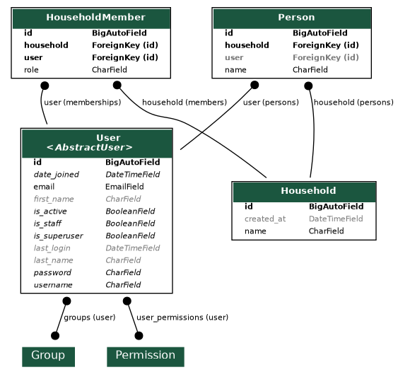

# tout-pris-back

Backend Django for Tout Pris, with [Django REST Framework](https://www.django-rest-framework.org) for the API, [drf-spectacular](https://drf-spectacular.readthedocs.io) for its OpenAPI schema, [drf-pydantic](https://github.com/georgebv/drf-pydantic) to derive serializers from Pydantic models, and [django-allauth](https://docs.allauth.org) in headless mode for authentication.

There is no Makefile: `manage.py` is the entry point for everything that touches the application or the database, and this README lists every other command.

## Quickstart

```bash
docker compose build   # build the dev image
docker compose up -d   # start the API on http://localhost:8000 (docs at /api/docs)
docker compose down    # stop it
```

Migrations are applied by the container entrypoint on every start, so the database is always up to date. Alongside the API, compose starts [Mailpit](https://mailpit.axllent.org) on <http://localhost:8025>: every email the application sends lands there, rendered, with its links clickable. That is where a signup is completed in development.

## Commands

Without Docker, everything runs through uv (`uv sync` once to install the dependencies). Inside Docker, prefix the same commands with `docker compose exec api`.

### Docker

```bash
docker compose build              # build the dev image
docker compose up -d              # start the API in the background
docker compose down               # stop it
docker compose logs -f api        # follow the API logs
docker compose exec api sh        # open a shell in the running container
docker compose logs -f mailpit    # follow the mail collector logs
```

### Server

```bash
uv run python manage.py runserver 0.0.0.0:8000        # dev server with auto-reload
uv run python manage.py runserver_plus 0.0.0.0:8000   # same with the Werkzeug debugger (django-extensions)
```

### Database and migrations

```bash
uv run python manage.py migrate                    # apply the migrations
uv run python manage.py makemigrations             # generate the migrations for the model changes
uv run python manage.py showmigrations             # list the migrations and their state
uv run python manage.py sqlmigrate accounts 0001   # print the SQL of a migration without applying it
uv run python manage.py reset_db                   # drop the dev database (django-extensions)
uv run python manage.py seed                       # fill it with one realistic household
uv run python manage.py createsuperuser            # create an admin account
uv run python manage.py changepassword camille     # give a password to a seeded account
```

The dev database is a SQLite file (`tout_pris.db`) never versioned in git. Rebuild it from scratch in one line:

```bash
uv run python manage.py reset_db --noinput && uv run python manage.py migrate && uv run python manage.py seed
```

`seed` is the equivalent of `rails db:seed`. It builds with [model_bakery](https://model-bakery.readthedocs.io) one household named *Famille Martin*, two accounts with a person each — Camille the owner and Sacha the member — and two children without account, Jeanne and Louis. The values are fixed rather than random, so every developer browses the same household, and the generator model_bakery uses for anything left unsaid is seeded, so two runs produce the same database.

It expects an empty database: run it right after `reset_db` and `migrate`, never on top of an already seeded one, where the unique email would abort the whole transaction. The seeded accounts have no usable password — give one with `changepassword`, or create your own account with `createsuperuser`.

### Shell and checks

```bash
uv run python manage.py shell_plus         # shell with every model imported (django-extensions)
uv run python manage.py check              # run the Django system checks
uv run python manage.py check_integrity    # list the states the model forbids but the schema cannot prevent
```

`check_integrity` reads the database and names what should not be there: an account without a personal household, a shared household without a member, a person whose account is not a member of their household. These invariants live in the application code rather than in a constraint — the first would need a foreign key cycle, the other two a count no column can hold — so nothing but this command sees them broken. It says nothing and exits `0` on a healthy database, and lists what it found and exits non-zero otherwise, which is what a scheduled run needs.

It names, it never repairs: a fix applied to a state nobody has explained yet erases the trace of the bug that produced it.

### Tests, lint and format

```bash
uv run pytest                # run the test suite (fails under 100% coverage)
uv run ruff check .          # lint
uv run ruff check --fix .    # lint and autofix
uv run ruff format .         # format
uv run ruff format --check . # check the formatting without rewriting
npx markdownlint-cli2 "**/*.md"   # lint the markdown, as CI does
```

Generated migrations are written with Django's own formatting: run `uv run ruff format .` after `makemigrations`.

### OpenAPI export

```bash
uv run python manage.py spectacular --file openapi.yaml
```

### Production

```bash
DJANGO_SECRET_KEY=... docker compose -f docker-compose.prod.yml up -d
```

## API

- `GET /api/health` — health check
- `GET /api/households/` — the households the caller belongs to, their personal one first
- `POST /api/households/` — create a shared household, joined as its owner
- `/api/households/{household_id}/` — rename or delete a shared household
- `/api/households/{household_id}/persons/` — the people of a household, created, renamed and deleted
- `POST /api/households/{household_id}/persons/{id}/claim/` — say which of them you are when joining
- `/api/households/{household_id}/members/` — who has access to a shared household, their role, handing it over, and removing one of them
- `/api/households/{household_id}/invitations/` — invite an address into a shared household, list the pending invitations, cancel one
- `POST /api/invitations/accept/` — join a household with the token received by email
- `/api/auth/browser/v1/` — headless authentication: signup, login, session, email verification, password reset, external providers
- `/accounts/` — OAuth callbacks of the external providers (no page is rendered)
- `GET /api/docs/` — interactive documentation rendered by drf-spectacular
- `GET /api/schema/` — OpenAPI schema served by the running app
- `/admin/` — Django admin

## OpenAPI

drf-spectacular generates the schema from the code. It is committed as [`openapi.yaml`](openapi.yaml) and regenerated with the `spectacular` command above. CI fails if the committed file drifts from the code, so regenerate it whenever routes or schemas change.

The authentication endpoints are not DRF views, so drf-spectacular cannot see them and `openapi.yaml` does not describe them. django-allauth publishes its own specification instead, served at `/api/auth/openapi.yaml` and `/api/auth/openapi.json`, derived from its code and pruned to the configuration actually loaded. There are two specifications on purpose: see [`docs/api/`](docs/api/README.md).

## Migrations

Schema migrations are Django migrations, applied by the Docker entrypoint at container start — never by the application code. After changing a model, generate a migration with `makemigrations`, read the generated file, and check the SQL with `sqlmigrate` when in doubt. CI fails if a model change has no migration.

## Schema diagram



`graph_models` (django-extensions) draws it from the models, and the image is committed as `docs/model/schema.png`:

```bash
uv run python manage.py graph_models accounts households --no-inheritance --exclude-models "Abstract*" | grep -v '// Created:' > docs/model/schema.dot
uv run python manage.py graph_models accounts households --no-inheritance --exclude-models "Abstract*" --output docs/model/schema.png
```

Rendering needs the `dot` binary from graphviz — installed in the dev image, therefore in the devcontainer too, and `apt install graphviz` or `brew install graphviz` on a host running without Docker.

CI regenerates the intermediate `docs/model/schema.dot` and fails if it drifts from the models. Its only unstable line is the `// Created:` timestamp, stripped by the `grep -v` above, so the committed file carries none. **The image itself is not checked**, because two versions of graphviz render the same schema differently.

So the `.dot` is the reference: it is the file CI compares to the models, and when the two disagree the image is the stale one. The two commands above are one gesture, not two — run them together after a model change, in the same pull request as the migration, or the diagram the README displays quietly falls behind the schema it claims to draw.

The diagram shows field names and types, never the `help_text` descriptions. They keep serving the admin and the generated OpenAPI, but the schema documentation no longer displays them.

## Configuration

Settings are read from the environment. [`.env.example`](.env.example) lists every variable with a development value — copy it to `.env`, which git ignores and docker compose reads on its own.

| Variable | Default | Role |
| --- | --- | --- |
| `DATABASE_URL` | `sqlite:///tout_pris.db` | Database, parsed by dj-database-url. |
| `DJANGO_SECRET_KEY` | an insecure development key | Django secret key. Mandatory in production. |
| `DJANGO_DEBUG` | `true` | Debug mode. Set it to `false` in production. |
| `DJANGO_ALLOWED_HOSTS` | `*` | Comma-separated list of allowed hosts. |
| `FRONTEND_URL` | `http://localhost:5173` | Base URL of the Svelte front, used to build the email verification and password reset links. |
| `BREVO_API_KEY` | empty | Brevo API key. When set, every email goes through Brevo, in development too. Mandatory in production. |
| `EMAIL_HOST` | empty | SMTP host the emails go to when `BREVO_API_KEY` is empty. Compose sets it to `mailpit`. |
| `EMAIL_PORT` | `1025` | Port of that SMTP host. |
| `MAIL_FROM_EMAIL` | `no-reply@tout-pris.app` | Sender address, must be a sender validated in Brevo. |
| `MAIL_FROM_NAME` | `Tout Pris` | Sender display name. |

The Brevo key and the Django secret key are secrets: never commit them, pass them through the environment.

## Transactional emails

Transactional emails (email verification, password reset, account notifications) are sent through [Brevo](https://developers.brevo.com) with the synchronous `brevo-python` client, from `tout_pris/mail.py`.

`BrevoEmailBackend` exposes it as a Django mailer, so django-allauth and any other application code send mail through `django.core.mail` without knowing about Brevo.

Which mailer `MAILERS["default"]` holds is decided in `settings.py` from the environment, and reads out loud: a real key, Brevo; an SMTP host, that host; neither, the console.

| Context | Mailer | Where the email is read |
| --- | --- | --- |
| Tests | in-memory, imposed by Django | `django.core.mail.outbox` |
| Development with docker | SMTP to Mailpit | the web interface on <http://localhost:8025> |
| Development with a Brevo key | Brevo | the real inbox |
| Off docker, CI, agent | console | standard output |
| Production | Brevo | — |

The console branch is what makes the verification link readable with no configuration at all, so a fresh clone can complete a signup. It is a development branch only: Django's deployment checks reject the console mailer once `DJANGO_DEBUG` is off, so a production start without a Brevo key fails loudly instead of printing the emails into the logs. Tests never reach the network whatever the environment holds: Django swaps every mailer for its in-memory one.

The environment variables are named `EMAIL_HOST` and `EMAIL_PORT`, but `settings.py` stores them in lowercase names: Django refuses to start when those two settings are defined next to `MAILERS`, since they are the deprecated way of configuring the same thing.

## Production image

The production image is built from `Dockerfile.prod` (multi-stage, [uv recommended practices](https://github.com/astral-sh/uv-docker-example)): uv builds the venv from `uv.lock` in a builder stage, and the final image contains neither uv nor pip, runs as a non-root user, and serves the WSGI application with gunicorn.

CI publishes it to Docker Hub for `linux/amd64` and `linux/arm64` (Raspberry Pi and other ARMv8 boards): every merge on `main` pushes the `dev` tag, and every git tag pushes the matching semver tags plus `latest`.

The production settings live in `docker-compose.prod.yml`: the database is stored in the `tout_pris_data` named volume mounted on `/data` (`DATABASE_URL=sqlite:////data/tout_pris.db`), separate from the dev database (`tout_pris.db` at the repo root).

## Project layout

- `manage.py` — Django entry point
- `tout_pris/` — project package: `settings.py`, `urls.py` (admin, and the API mounted on `/api/`), `views.py`, `mail.py`, `authentication.py`, `wsgi.py`, `asgi.py`
- `accounts/` — the custom `User` model, referenced by `AUTH_USER_MODEL` since the initial migration
- `households/` — the household domain: `Household`, `HouseholdMember`, `Person` and `Invitation`, their admin and API, the personal household created at signup, and the `seed` and `check_integrity` commands
- `.env.example` — every environment variable with a development value
- `tests/` — pytest-django test suite
- `docs/api/` — the API conventions: status codes, household scoping, schemas, collections
- `docs/model/` — the functional need behind the data model, independent of the framework, and the generated schema diagram

A devcontainer is provided (`.devcontainer/`) based on the compose `api` service.
