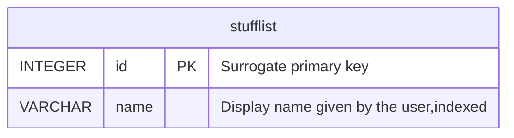

# tout-pris-back

Backend FastAPI for Tout Pris.

## Quickstart

```bash
make build   # build the Docker image
make up      # start the API on http://localhost:8000 (docs at /docs)
make down    # stop it
```

## Development

```bash
make test    # pytest
make lint    # ruff check + format check
make fmt     # ruff autofix + format
```

A devcontainer is provided (`.devcontainer/`) based on the compose `api` service.

## Production image

The production image is built from `Dockerfile.prod` (multi-stage, [uv recommended practices](https://github.com/astral-sh/uv-docker-example)): uv builds the venv from `uv.lock` in a builder stage, and the final image contains neither uv nor pip and runs as a non-root user. This is the image published to Docker Hub on tags.

```bash
docker compose -f docker-compose.prod.yml up -d
```

The production settings live in `docker-compose.prod.yml`: the database is stored in the `tout_pris_data` named volume mounted on `/data` (`DATABASE_URL=sqlite:////data/tout_pris.db`), separate from the dev database (`tout_pris.db` at the repo root).

## API

- `GET /health`
- `POST /stufflists` — create a stufflist (`{"name": "..."}`)
- `GET /stufflists` — list stufflists
- `GET /stufflists/{id}` — get one
- `DELETE /stufflists/{id}` — delete one

Data is stored in SQLite (`tout_pris.db` by default, override with `DATABASE_URL`).

## OpenAPI

FastAPI generates the OpenAPI schema automatically. With the server running it is served at `/openapi.json`, with interactive docs at `/docs` (Swagger UI) and `/redoc` (ReDoc).

The schema is also committed as [`openapi.json`](openapi.json) and regenerated with `make openapi`. CI fails if the committed file drifts from the code, so regenerate it whenever routes or schemas change.

## Migrations

Schema migrations are managed with [Alembic](https://alembic.sqlalchemy.org) and run automatically when the app starts. After changing a SQLAlchemy model, generate a migration with `make migration m="describe the change"` and review the generated file; `make migrate` applies migrations without starting the server.

## Database schema

Generated from the SQLAlchemy models with [paracelsus](https://github.com/tedivm/paracelsus); regenerate with `make erd` after any model change (CI fails if it drifts). Column descriptions come from the `comment=` metadata on the models.

<!-- BEGIN_SQLALCHEMY_DOCS -->

<!-- END_SQLALCHEMY_DOCS -->

## Dev database lifecycle

The database is never versioned in git — rebuild it at will, Rails style:

```bash
make db-init   # create the database and apply migrations
make db-seed   # fill it with factory data (polyfactory on the Pydantic schemas)
make db-reset  # drop + init + seed
make db-drop   # delete the SQLite file and its WAL sidecars
```

Seeding is reproducible (fixed random seed) and reuses the factories from `app/factories.py`.
